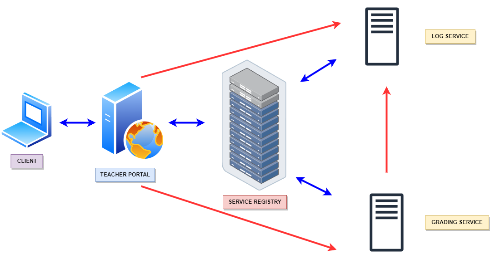

# gradebook_app

Gradebook Microservices Application with Go

---

# High Level Architecture

---

# Components

| Service Registry     | Log Service         | Grading Service  | Teacher Portal  |
|----------------------|---------------------|------------------|-----------------|
| Service Registration | Centralized Logging | Business Logic   | Web Application |
| Health Monitoring    |                     | Data Persistence | API Gateway     |

---

# Workflow

**Service Registration**
* Create a web service (log service)
* Create the registry service (service registry)
* Register the web service
* Deregister the web service
---
**Service Discovery**
* Create the grading service
* Request required services on startup
* Notify when new services start
* Notify when services shut down
---
