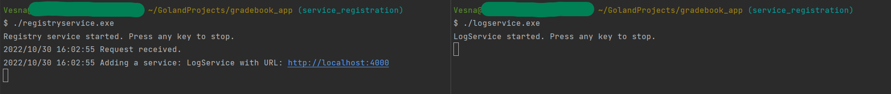
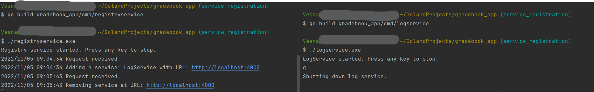

# Standalone Log Service

## Build
`go build gradebook_app/cmd/logservice`

This will create the binary `logservice.exe`.

---

## Run 
`./logservice.exe`

To stop the service, press any key.

---
## Test

Test your service in Postman. Send a POST request. Target `/log`. 

This should log the body's request in `app.log`.

---

## Registering Log Service

The app is not Dockerized, so use two terminals to check if the log service can be registered with the service registry.

Terminal 1:
* Rebuild the Registry service.
* Start the Registry service.

Terminal 2:
* Rebuild the Log service.
* Start the Log service.

The request to register got received. And log service with URL `localhost:4000` was added, which is exactly where the log service is running at. 

---

## Deregistering Log Service

The request to deregister got received.

