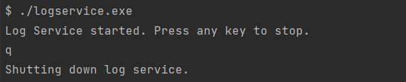
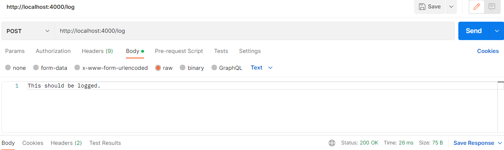

# Standalone Log Service

## Build
`go build gradebook_app/cmd/logservice`

This will create the binary `logservice.exe`.

---

## Run 
`./logservice.exe`

---
## Test

Test your service in Postman. Send a POST request. Target `/log`. 

This should log the body's request in `app.log`.

---

To stop the service, press any key.
