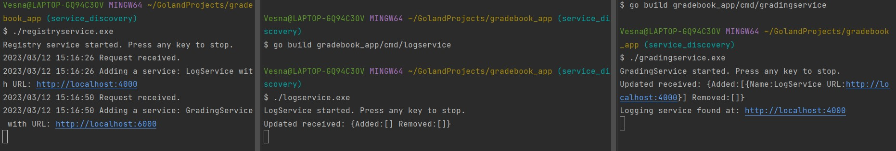
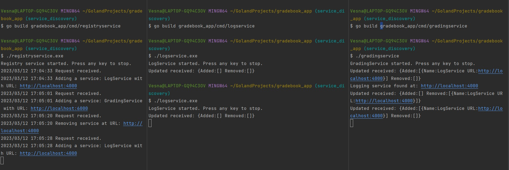

### Notify a service when a dependency is started

 Steps to achieve this:
- Run registry service
- Run log service
- Run grading service

---

### Notify a service when a dependency is stopped

Steps to achieve this:
- Run registry service
- Run logging service
- Run grading service
- Stop logging service
- Re-run logging service

