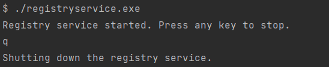

# Registry Service

## Build
`go build gradebook_app/cmd/registryservice`

This will create the binary `registryservice.exe`.

---

## Run 
`./registryservice.exe`

To stop the service, press any key.

---

