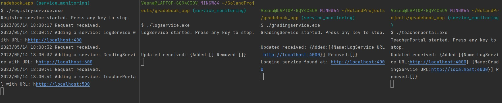
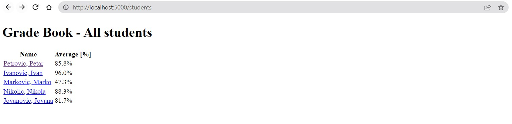
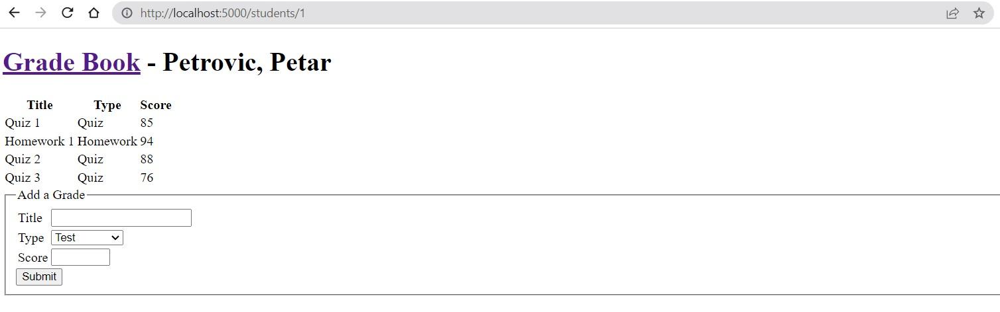

# How to run Teacher Portal App 

The app is not Dockerized (yet), so use four terminals to check if the distributed system and all its services work as expected.

Terminal 1:
* Rebuild the Registry service.
* Start the Registry service.

Terminal 2:
* Rebuild the Log service.
* Start the Log service.

Terminal 3:
* Rebuild the Grading service.
* Start the Grading service.

Terminal 4:
* Rebuild the Teacher Portal service.
* Start the Teacher Portal service.

You should see something like this.

Go to your browser and navigate to **http://localhost:5000/** to interact with the app.

